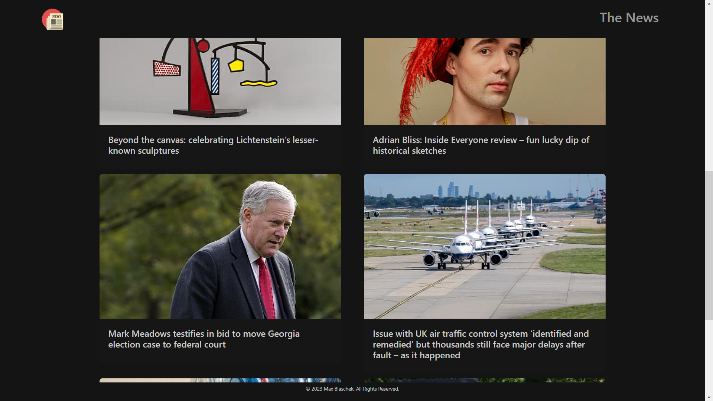
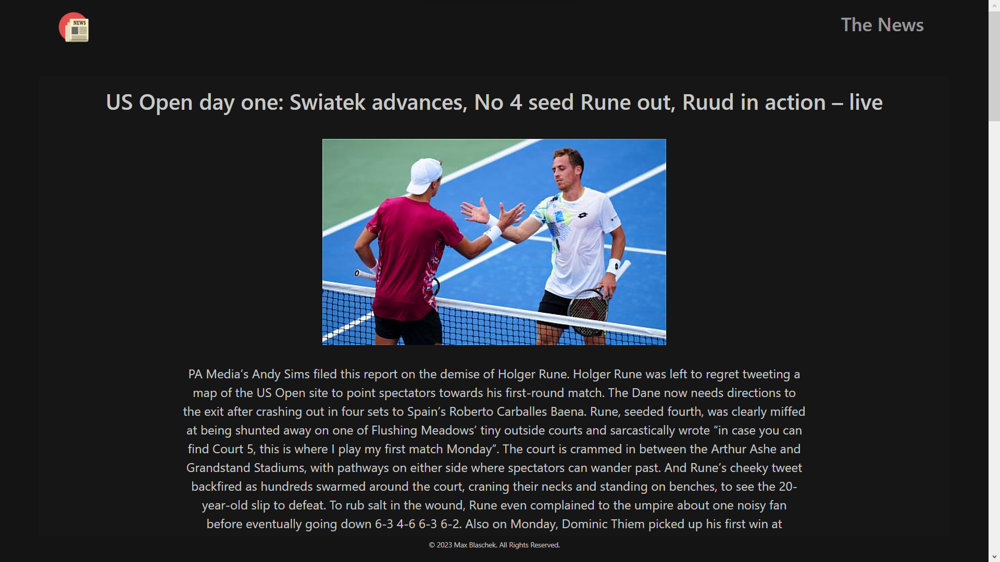

## A single page application in React that sends requests to the Guardian API to get Headline and Article data before displaying them.

Overview: The News Summary Challenge is a simple news app that uses the Guardian News API (https://open-platform.theguardian.com/) to display the current News, the articles are displayed as clickable links that open the full article.

## Screenshots




## Installation and Setup

1. **Clone the repository**:

   ```bash
   git clone https://github.com/MaxB-Coder/news-summary.git
   cd news-summary
   ```

2. **Install dependencies**:

   ```bash
    npm install
   ```

3. **Run the Server**:

   ```bash
    npm run dev
   ```

Visit the local host server that is in your console to view the project!

### Prerequisites

- Git
- Node.js

### Technologies

- React (Vite)
- React Router
- Axios
- Bootstrap
- Vitest

## Acknowledgements

- The Guardian for the API.
- Digital Futures for setting this project as a challenge.
